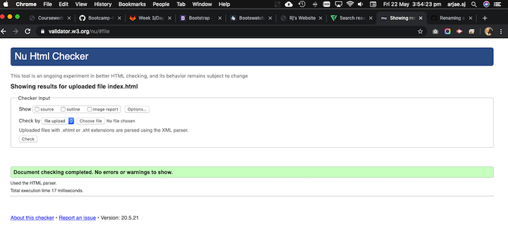

# Bootcamp-Homework-2
UWA Coding Bootcamp Homework for Week 2

Repository contains files for My Website which have the following pages: About me, Portfolio & Contact Me.

The website was constructed using Bootstrap elements and Bootswatch Slate theme and should be responsive.

Deployed link: https://arjaesj.github.io/Bootcamp-Homework-2/

HTML files have beed validated using Nu HTML Checker.
Here are the results:

 

 

