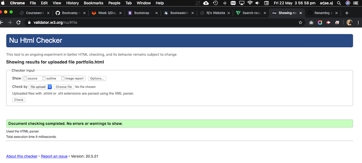
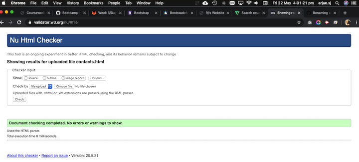
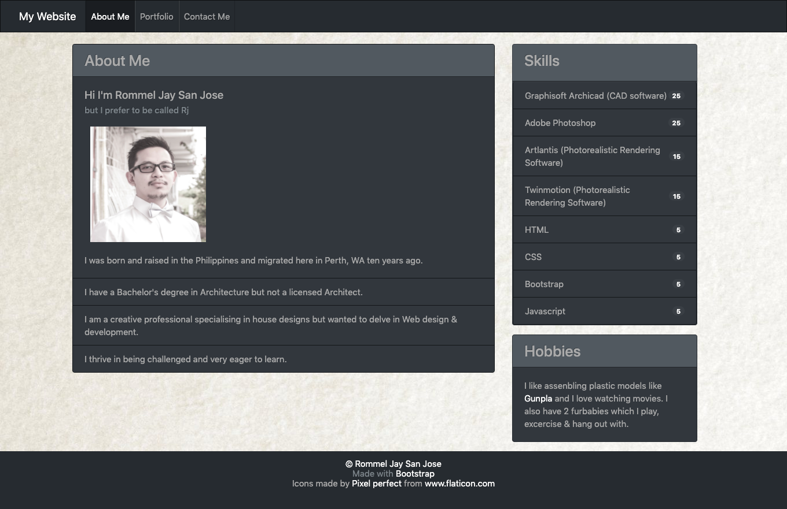
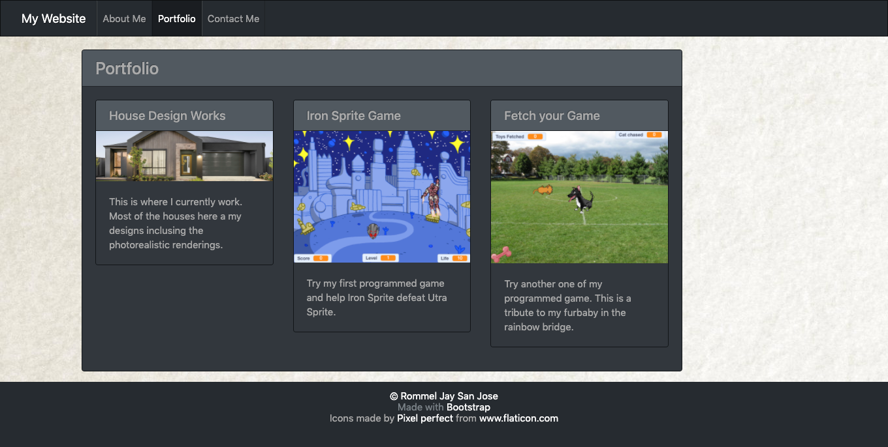
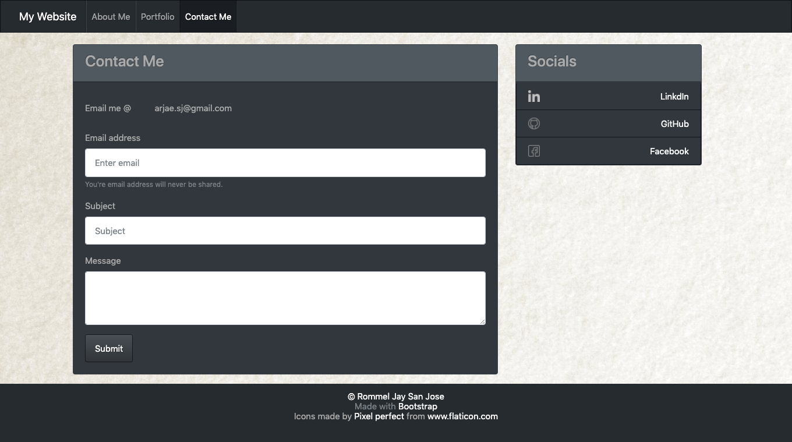

# Portfolio

Repository contains files for My Website which have the following pages: About me, Portfolio & Contact Me.

The website was constructed using Bootstrap elements and Bootswatch Slate theme and should be responsive.

Deployed link: https://arjaesj.github.io/portfolio/.

HTML files have beed validated using Nu HTML Checker.
Here are the results:

 

 

Here are the screenshots of My Website:

About Me page:

Portfolio page:

Contact Me page:

